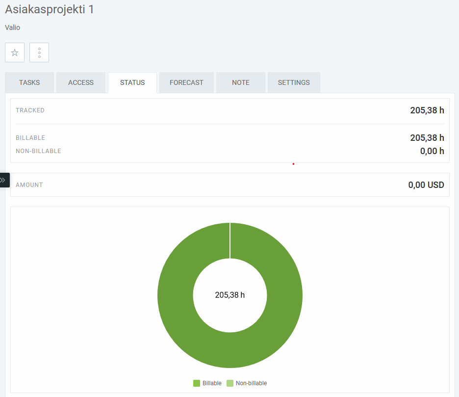

# fmi-data-toolkit (Customer project 1)
-Valtteri Airaksinen TTV20SAI / Valio Primary production team 

This repository contains code and documentation about fetching data from fmi (Finnish Meterological Institute) for the use of a neural network.

### Course requirements
- 200h of documented work.
- All documentation will be done in english.
- The following documents must be created during the course:
    - [Project plan](documents/project-plan.pdf) (6-10 pages, inc. front page, table of contents, etc.)
    - [Project requirements](documents/project-requirements.pdf) (inc. required timetable and required amount of work.)
    - [Use case diagram](documents/usecase-diagram.pdf) (min. 7 use cases)
    - [Sequence diagrams](documents/sequence-diagrams.pdf) (min. 4pcs)
    - [Final report](documents/finalreport.pdf)
    - [Lessons Learned](documents/lessonslearned.pdf) -document
- The course must contain following elements:
    - Customer needs, which have been described in the documentation
    - Use of AI in the issue
    - Implementing a web environment for AI (e.g. feeding data to the AI, reporting results or collecting data.)

### Required data

### Daily weather data

| Required field | Source | Parameter name |
|:-:|:-:|:-:|
| temp_avg | kriging_suomi_daily | DailyMeanTemperature |
| temp_min | kriging_suomi_daily | MinimumTemperature24h |
| temp_max | kriging_suomi_daily | MaximumTemperature24h |
| prec | kriging_suomi_daily | Precipitation24h |
| wind_speed_avg | kriging_suomi_hourly | WindSpeedMS |
| wind_speed_max | kriging_suomi_daily | MaximumWind |
| rel_humid_avg | kriging_suomi_hourly | Humidity |
| rel_humid_max | kriging_suomi_hourly | Humidity |
| rel_humid_min | kriging_suomi_hourly | Humidity |
| global_rad | krging_suomi_daily | DailyGlobalRadiation |
| vapour_press | kriging_suomi_hourly | Temperature & Humidity ([Formula 1](https://www.vaisala.com/fi/expert-article/relative-humidity-how-is-it-defined-and-calculated) & [Formula 2](https://www.vaisala.com/fi/lp/make-your-job-easier-humidity-conversion-formulas))  |
| snow_depth | kriging_suomi_snow | WaterEquivalentOfSnow |

---

### 3h weather data
| Required field | Source | Parameter name |
|:-:|:-:|:-:|
| temp | kriging_suomi_synop | Temperature |
| wind_speed | kriging_suomi_synop | WindSpeedMS |
| rel_humid | kriging_suomi_synop | Humidity |

---

### 1h weather data (not required but used for calculating)
| Required field | Source | Parameter name |
|:-:|:-:|:-:|
| - | kriging_suomi_hourly | Precipitation1h |
| - | kriging_suomi_hourly | Humidity |
| - | kriging_suomi_hourly | WindSpeedMS |
| - | kriging_suomi_hourly | Temperature |

---

## Weather-collector

Collects historical weather data from the **Finnish Meteorological Institute (FMI)** using an **Azure Function App**, outputting the data as a pandas DataFrame.

## Overview
This project provides an **Azure Function App** that:

- Fetches **daily historical weather data** from FMI’s API  
- Uses a Python-based function with a modular structure for easier maintenance  
- Is designed for **GitHub → Azure Function** deployment, installing dependencies during the build phase

## Repository Structure
```
weather-collector/
│
├── DataCollectorFunc/ # Azure Function entrypoint
│ ├── init.py # Function entry script
│ └── function.json # Azure Function configuration
│
├── shared/ # Core logic and utilities
│ ├── main.py # Main data collection logic
│ └── utils.py # Helper functions
│
└── .github/workflows/ # Deployment workflow
```

- **`DataCollectorFunc`**: Contains the function definition and configuration  
- **`shared`**: Reusable Python modules used by the function  
- **Workflow**: Dependencies are installed during the GitHub Actions build phase due to Azure Function deployment constraints  

## Time tracking

Time spent on this project was documented using clockify:

